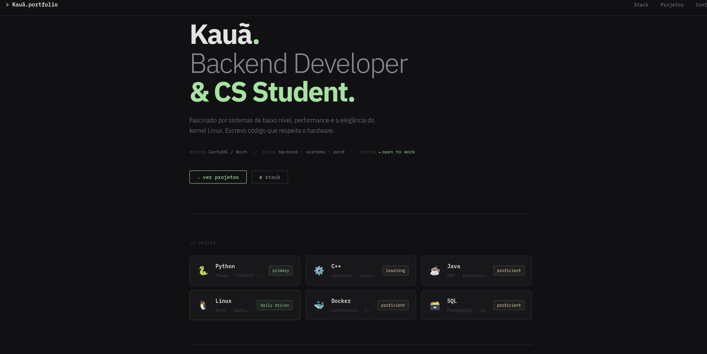

# MyPersona — Portfólio Pessoal

> Portfólio pessoal construído com Flask (Python). Backend serve templates Jinja2, frontend em HTML5/CSS3 puro.

---

## Estado Atual

| Item | Status |
|---|---|
| Estrutura Flask (factory pattern) | ✅ Pronto |
| Rota `/` com `home.html` | ✅ Pronto |
| Rota `/projetos` | ⚠️ Rota existe, falta o template `projetos.html` |
| `home.html` — Hero, Skills, About, CTA | ✅ Pronto |
| `base.html` — Nav + bloco de conteúdo | ✅ Pronto |
| `style.css` — Dark mode, responsivo | ✅ Pronto |
| `.gitignore` | ✅ Pronto |
| Formulário de contato | ❌ Não iniciado |
| Integração GitHub API | ❌ Não iniciado |
| Handlers de erro (404 / 500) | ✅ No `routes.py` corrigido |
| Deploy / produção | ❌ Não iniciado |

---

## Estrutura de Pastas

```
MyPersona/
├── app/
│   ├── __init__.py          # Factory function — cria e configura o app Flask
│   ├── routes.py            # Blueprint 'main' com todas as rotas
│   ├── static/
│   │   └── css/
│   │       └── style.css    # Estilos globais (dark mode, IBM Plex)
│   └── templates/
│       ├── base.html        # Layout base (nav + )
│       ├── home.html        # Página principal — estende base.html
│       └── projetos.html    # ⚠️ Ainda não criado
├── .venv/                   # Ambiente virtual (não vai pro git)
├── .env                     # Variáveis de ambiente (não vai pro git)
├── .gitignore
├── requirements.txt         # ⚠️ Ainda não gerado
└── run.py                   # Ponto de entrada — python run.py
```

---

## Como Rodar

```bash
# 1. Clonar e entrar na pasta
git clone https://github.com/seu-usuario/mypersona.git
cd mypersona

# 2. Criar e ativar o ambiente virtual
python -m venv .venv
source .venv/bin/activate        # Linux / macOS
# .venv\Scripts\activate         # Windows

# 3. Instalar dependências
pip install -r requirements.txt

# 4. Configurar variáveis de ambiente
cp .env.example .env
# edite o .env com seus valores

# 5. Rodar em modo desenvolvimento
python run.py
# acesse http://127.0.0.1:5000
```

---

## Arquivos — Resumo Técnico

### `run.py`
Ponto de entrada da aplicação. Chama `create_app()` e sobe o servidor de desenvolvimento.

```python
from app import create_app

app = create_app()

if __name__ == "__main__":
    app.run(debug=True)
```

> ⚠️ `debug=True` **nunca deve ir para produção.** Usar variável de ambiente para controlar isso.

---

### `app/__init__.py`
Implementa o **factory pattern** — cria a instância Flask e registra o Blueprint principal.

```python
from flask import Flask
from .routes import main

def create_app():
    app = Flask(__name__)
    app.register_blueprint(main)
    return app
```

---

### `app/routes.py`
Blueprint `main` com as rotas da aplicação e handlers de erro globais.

| Método | Rota | Função | Template |
|---|---|---|---|
| GET | `/` | `principal()` | `home.html` |
| GET | `/projetos` | `projetos()` | `projetos.html` ⚠️ |

Handlers registrados: `404` → `404.html` · `500` → `500.html`

---

### `app/templates/base.html`
Layout base com nav fixo (sticky), link para `style.css` via `url_for`, e bloco `` para as páginas filhas.

```
nav
└── .nav__logo  →  /
└── .nav__links →  #skills · #projetos · #contato

div.container
└──  ← pages renderizam aqui
```

---

### `app/templates/home.html`
Estende `base.html`. Contém 4 seções:

| Seção | Conteúdo |
|---|---|
| **Hero** | Prompt shell falso, título, subtítulo, meta (distro / focus / status), botões CTA |
| **Skills** | Grid de cards: Python · C++ · Java · Linux · Docker · SQL com badge de nível |
| **About** | Texto + widget de terminal simulado com `uname -a` e `git log` |
| **CTA** | Chamada para contato via e-mail |

---

### `app/static/css/style.css`
| Decisão | Valor |
|---|---|
| Tema | Dark mode (`#111113`) |
| Fontes | IBM Plex Mono + IBM Plex Sans (Google Fonts) |
| Paleta | Catppuccin Mocha — verde `#a6e3a1`, azul `#89b4fa`, amarelo `#f9e2af` |
| Layout | CSS Grid + Flexbox, mobile-first |
| Animações | `fadeIn` com `animation-delay` por seção, cursor piscando no terminal |

---

## Dependências

```txt
# requirements.txt — gerar com: pip freeze > requirements.txt
Flask==3.0.3
Werkzeug==3.0.3
python-dotenv==1.0.1
```

> Gere o arquivo após instalar: `pip freeze > requirements.txt`

---

## Próximos Passos

- [ ] Criar `app/templates/projetos.html`
- [ ] Criar `app/templates/404.html` e `500.html`
- [ ] Gerar `requirements.txt` (`pip freeze > requirements.txt`)
- [ ] Criar `.env.example` com as variáveis necessárias
- [ ] Implementar formulário de contato (`contact_handler.py`)
- [ ] Integrar GitHub API para listar repositórios dinamicamente
- [ ] Configurar `debug=False` via variável de ambiente
- [ ] Deploy com Gunicorn + configurar serviço systemd ou plataforma PaaS
